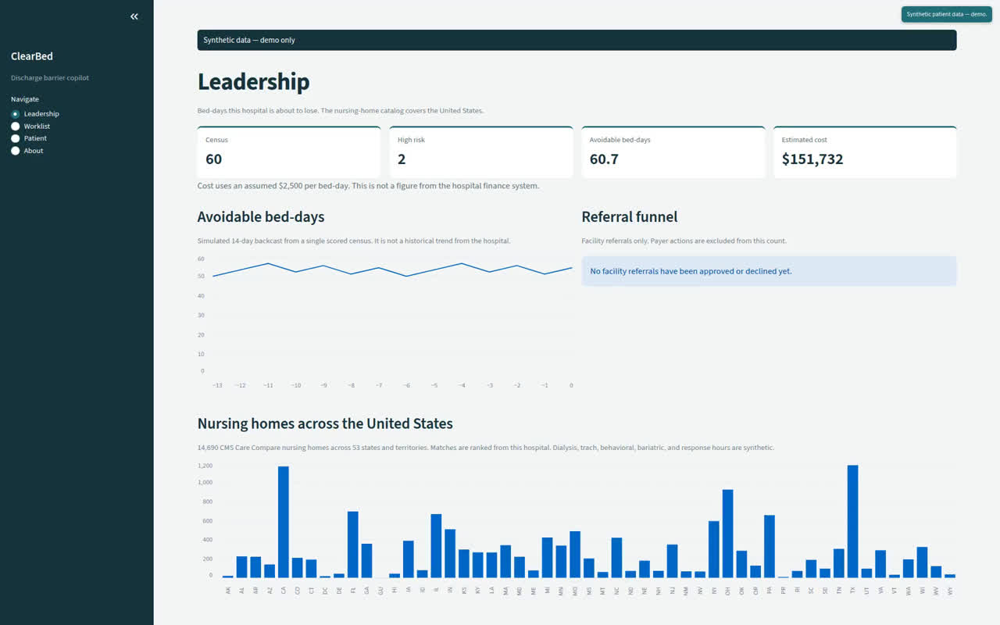
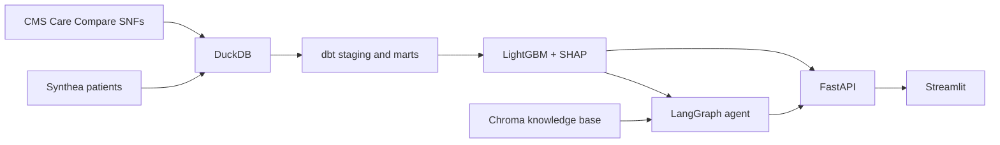

# ClearBed

ClearBed predicts, on admission, which inpatients are likely to remain in a bed after they are medically ready to leave, and why. The barriers it tracks are post-acute placement, payer authorization, guardianship or capacity, and home services. An agent then matches synthetic patients to real United States skilled nursing facilities, drafts a referral packet, checks payer rules, and waits for a person to approve anything that would leave the building.

Hospitals lose staffed beds to patients who are medically ready but have nowhere to go. Placement, coverage, and guardianship work happens in inboxes, so the delay is invisible until the bed-day count is already high. ClearBed makes that delay visible on admission and gives case management a sourced next step. The facility catalog is the national CMS Care Compare file. This demo hospital is in Boston, and matches are ranked from that hospital.

**Synthetic patients only, unless `DATA_MODE` is changed.** Facility characteristics from CMS Care Compare are real. Acceptance profiles (dialysis, trach/vent, behavioral, bariatric, response time) are synthetic and labeled as such. This is not a medical device.


## Walkthrough

[](docs/walkthrough.mp4)

[Play the walkthrough](docs/walkthrough.mp4) (37 seconds). It starts on Leadership: census 60, 2 high-risk stays, 60.7 avoidable bed-days, the assumed $2,500 per bed-day, and 14,690 CMS nursing homes across 53 states and territories. It filters the worklist to high risk, opens the Medicare placement stay, and generates a plan. The Boston map sits beside the risk reasons, with the score breakdown, the Medicare three-day citation, and `[NEEDS INPUT]` in the packet. Approve writes a local Sent status. The packet is not transmitted.

The recording script, voiceover, and shot list are in [docs/demo_script.md](docs/demo_script.md). Confirm the MHA figures in that script against the current Massachusetts Health & Hospital Association brief before you publish them. The pilot outline is [docs/pilot_proposal.md](docs/pilot_proposal.md). End card: **ClearBed · Free 60-day pilot · Deva Choppa · 617-602-6800**. App scenes show the corner badge **Synthetic patient data — demo.**

## Architecture



## Quickstart

```bash
cp .env.example .env
make setup
make data          # Synthea CSVs + CMS nursing homes -> data/warehouse.duckdb
make all           # data, dbt, quality report, train, score, knowledge base
make api           # http://localhost:8000/docs
make ui            # http://localhost:8501
```

`make all` already includes `make data`. After the warehouse, models, and knowledge base exist:

```bash
docker compose up
```

Optional local model:

```bash
docker compose --profile llm up
```

## Common commands

| Command | What it does |
| --- | --- |
| `make setup` | Install all uv dependency groups |
| `make lint` | Ruff and mypy |
| `make test` | Pytest |
| `make data` | Generate Synthea and load Synthea + CMS into DuckDB |
| `make dbt` | `dbt build` (models and tests) |
| `make data-quality` | Write `reports/data_quality.html` and fail on critical checks |
| `make train` | Train stuck-risk, barrier, and avoidable-day models |
| `make score` | Score a simulated current census into `app.worklist` |
| `make kb` | Embed the knowledge base into Chroma |
| `make api` | FastAPI on port 8000 |
| `make ui` | Streamlit on port 8501 |
| `make eval` | Golden-set agent evaluation |
| `make dbt-fixture` | dbt build against the tiny committed fixture |
| `make ci` | Lint, test, fixture dbt, and eval |

Synthea population and seed are `SYNTHEA_POPULATION` (default 5000) and `SYNTHEA_SEED` (default 42). Set `FORCE_SYNTHEA=1` to regenerate CSVs that are already on disk.

## CMS nursing-home file

The loader reads `data/external/nh_provider_info.csv`. If that file is missing it downloads the CMS Provider Data Catalog dataset **Nursing Home Provider Information** (`4pq5-n9py`):

`https://data.cms.gov/provider-data/api/1/datastore/query/4pq5-n9py/0/download?format=csv`

The URL is `CMS_SNF_URL` in `.env`. To refresh the file by hand, download that CSV into `data/external/nh_provider_info.csv` and rerun `python -m clearbed.ingest.cms_snf_loader`. Rows for every US state and territory in the file are kept. Missing coordinates are filled from ZIP centroids. `est_open_beds` is `certified_beds - avg_residents_per_day`, floored at 0. The loaded table is `raw.cms_snf`.

`raw.snf_capabilities_synthetic` is a seeded synthetic acceptance profile. It is not reported by CMS.

## Model card summary

Models are trained on Synthea inpatient stays with a **documented synthetic labeling function**. Synthea has no discharge disposition and no delay reason. Labels come from `dbt/seeds/labeling_rules.csv` via `src/clearbed/features/labeling.py`. Metrics will look strong because the label is a noisy function of the same admission features. They are not clinical validation.

Held-out test on the synthetic label (see `models/model_card.md` after `make train`):

| Model | Metric | Value |
| --- | --- | --- |
| Stuck risk | AUROC | 0.716 |
| Stuck risk | AUPRC | 0.592 |
| Stuck risk | Brier | 0.198 |
| Barrier type | macro-F1 | 0.578 |
| Avoidable days | MAE | 2.66 days |

With PhysioNet credentialing, replace that function with MIMIC-IV `admissions.discharge_location` and length of stay.

Gender and race are excluded from the model matrix and reported only in `reports/fairness.md`. See `models/model_card.md` after `make train`.

## Evaluation

`make eval` writes `reports/agent_eval.md`. The run fails if any facility hard-filter is violated or if fewer than 95% of rule claims carry a citation. Knowledge-base text is quoted, never executed. A fixture with an injected instruction is required to be ignored.

## Limitations

- Labels are synthetic. Acceptance profiles for dialysis, trach/vent, behavioral health, bariatric care, and response time are synthetic.
- Rules in `knowledge/` are drafts. Verify them against current CMS and MassHealth pages before anyone relies on them. Each file is marked **VERIFY BEFORE USE**.
- The cost per bed-day (default $2,500) is an assumption for the leadership view, not a finance-system number.
- Groq is refused when `DATA_MODE` is not `synthetic`. Real data belongs on Ollama or Bedrock under a BAA.
- Nothing is sent to a facility without an explicit approval. There is no auto-send path.
- ClearBed is not a medical device and does not make a clinical determination.

## Production path

A production deployment would run in a HIPAA-eligible environment under a BAA, with Epic (or another EHR) feeding admissions through SMART on FHIR and HL7 ADT. Discharge disposition from the EHR would replace the synthetic labeling function. Case managers would accept or edit the plan, and those decisions would re-enter the model as a feedback loop. Payer rules would be owned by compliance and re-verified on a schedule. The human approval gate stays.

Engineering conventions for data, approvals, and configuration are in [docs/engineering.md](docs/engineering.md).

## Project layout

- `src/clearbed/ingest` — Synthea and CMS loaders
- `src/clearbed/features` — labeling function and data-quality report
- `src/clearbed/ml` — train, explain, score
- `src/clearbed/rag` — knowledge-base ingest and retrieval
- `src/clearbed/agent` — tools and the LangGraph copilot
- `src/clearbed/api` — FastAPI
- `app/streamlit_app.py` — case manager and leadership UI
- `dbt/` — staging, marts, and tests
- `knowledge/` — draft placement and payer notes
- `docs/demo_script.md` — 3:00 screen-recording script, voiceover, and AI shot prompts
- `docs/pilot_proposal.md` — one-page 60-day pilot outline
